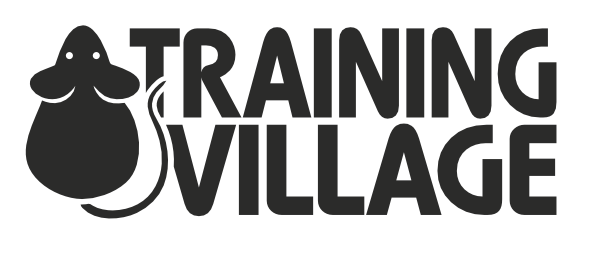

# Training Village

  <picture>
    <source media="(prefers-color-scheme: dark)" srcset="./docs/source/_static/logo_dark.svg">
    <source media="(prefers-color-scheme: light)" srcset="./docs/source/_static/logo_light.svg">
    
  </picture>

