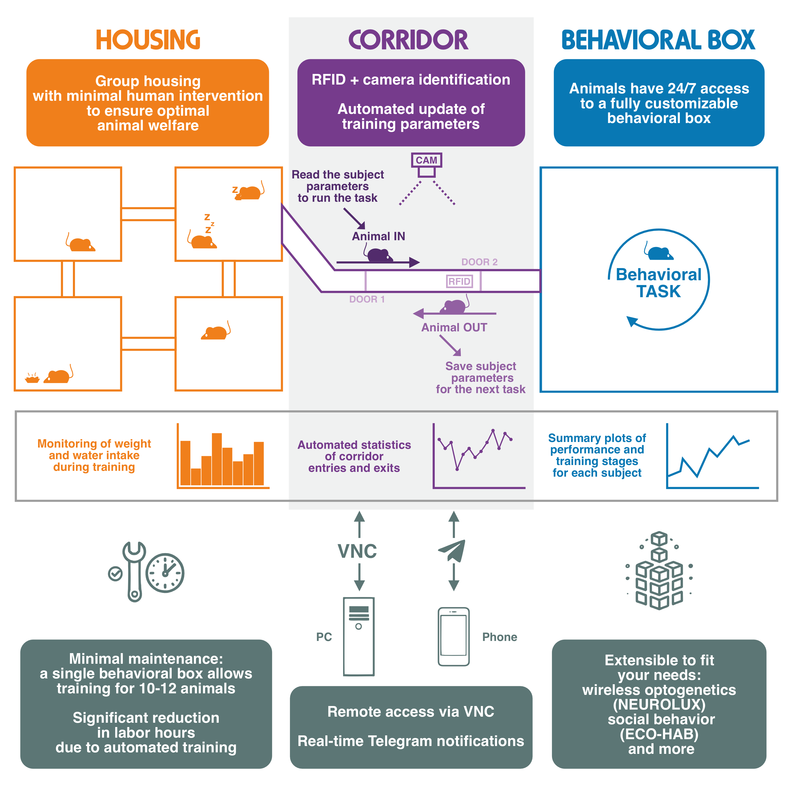
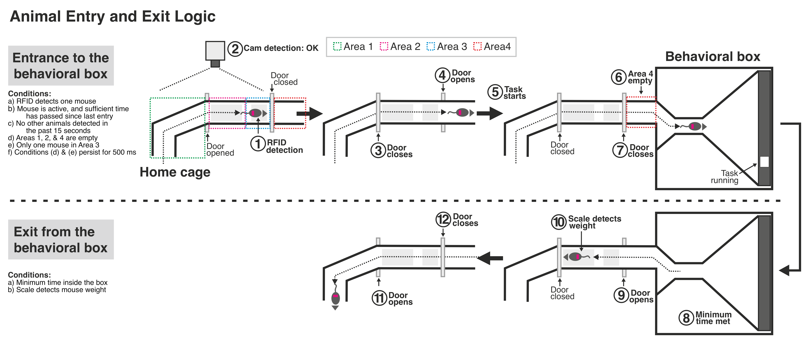

.. village documentation master file, created by
   sphinx-quickstart on Fri Dec  9 14:12:42 2022.
   You can adapt this file completely to your liking, but it should at least
   contain the root `toctree` directive.

.. toctree::
   :hidden:
   :maxdepth: 2
   :caption: Contents:

   index
   user_guide/index.md
   how_to_build/index.md
   data_collection.md
   api_index

What is the Training Village?
=========================================================

The Training Village is a system designed for the automated training of rodents.
It allows animals to live in the system 24/7 and access a behavioral box to perform
tasks at any time, day or night. Users can either design their own training protocols
or use one of the available ones (e.g., 2AFC).
The system monitors the animals through two cameras—one in the entry corridor and
another inside the behavioral box. Remote access is available at any time to check
on the system's status. Additionally, a configurable alert system integrated with
Telegram allows users to receive real-time notifications regarding system conditions.

|
.. video:: _static/video.m4v
|

How Does It Work?
=========================================================

The system is composed of several key components: the housing where the animals live,
the behavioral box where tasks are performed, and the corridor that regulates access
to the behavioral box.

**The Housing:** The animals live together in one or more cages, which promotes better
welfare. Any type of cage can be used, as long as it is connected to the corridor
via a tube. We offer a solution with 2 or 4 cages connected by transparent acrylic
tubes, which can serve different purposes (e.g., one cage with food, another
for resting). Optionally, RFID sensors can be installed in the corridors connecting the
cages (ECOHAB(link))) to gather more data on the animals’ social behavior.

**The Behavioral Box:** Any type of behavioral box can be used. We provide two design
options: one with auditory stimuli and three behavioral ports, and another with a
touchscreen and one port. The system is designed to interact with behavioral boxes
controlled by Bpod (using Python). Integration with other controllers, such as Bcontrol
or Bonsai, is currently under development.

|
|

The Corridor
=========================================================
This is the central part of the system, consisting of a plastic corridor
equipped with an RFID sensor, a weight scale, and a camera. Using a mechanism with two
doors, animals can enter the behavioral box under certain conditions. The entire system
is controlled by a Raspberry Pi, which handles sending and receiving signals from
electronic devices, controls the cameras, and runs the software that controls the whole
system.
Most of the elements in the mouse version of the corridor are 3D-printed, except for
the doors and the corridor lid, which are made of white laser-cut acrylic. The design
files are shared in the How to build the training village (link) section.
We also share the rat version, which includes more laser-cut parts and fewer printed
components due to its larger size and the increased strength required.

.. image:: _static/corridor.png
   :alt: Diagram
   :width: 640px
   :align: center
|

The Controller
=========================================================
The software that controls the system must run reliably 24/7 while monitoring the
animals, regulating their access to the behavioral box, initiating tasks, and
updating data.

We determined that the best option for running this system is the Raspberry Pi, due to
its reliability, low power consumption, and cost-effectiveness. These mini-computers
are designed to excel in tasks like these, come equipped with specialized video cameras,
 and can interact with a wide range of electronic devices.

To simplify interaction with the hardware components, we have designed a custom
Raspberry Pi HAT (Hardware Attached on Top). This HAT provides the necessary
connectors to control two servo motors, an RFID reader, a weight sensor, and a
temperature sensor. This setup ensures seamless device connectivity, delivering a
plug-and-play experience.

|

|

Open Source Project Develop by
=========================================================

|
.. raw:: html

   <a href="https://braincircuitsbehavior.org"
   style="color:#00008B; font-size:20px; font-weight:normal;
   font-family:'Futura', sans-serif; text-decoration:none;">
   BRAIN CIRCUITS AND BEHAVIOR LAB
   </a>
|

Contact: `marinraf@gmail.com <mailto:marinraf@gmail.com>`_

Training Village is an open-source project. You can find all the code in our
(`GitHub repository <https://braincircuitsbehaviorlab.github.io/village/>`_)
and all the necessary resources in the (`resources section </resources.md>`_).
