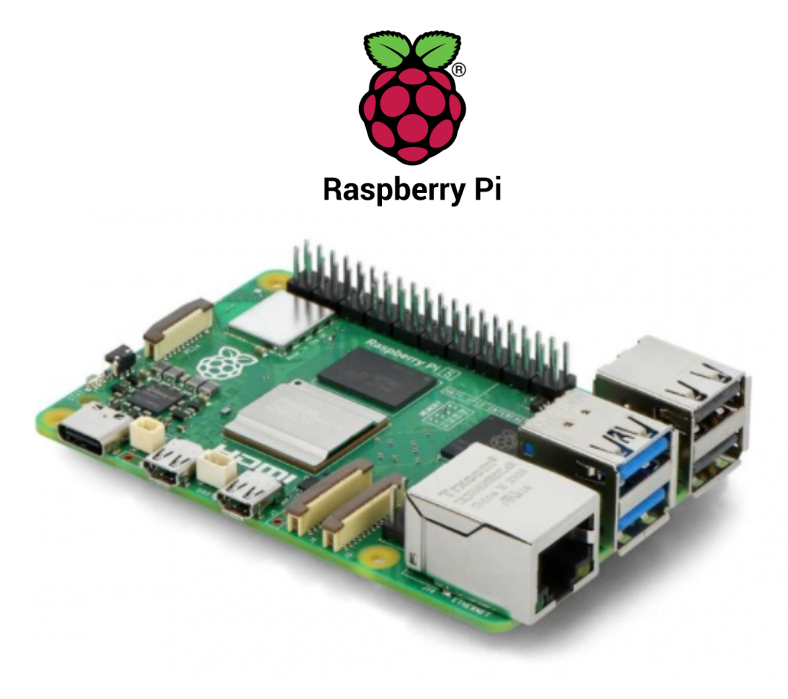
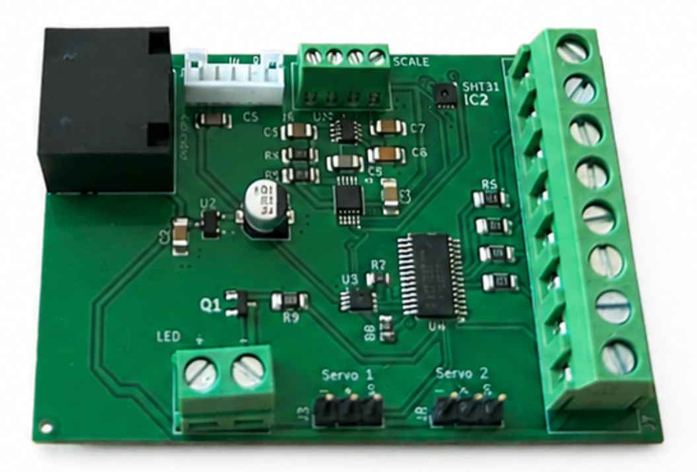
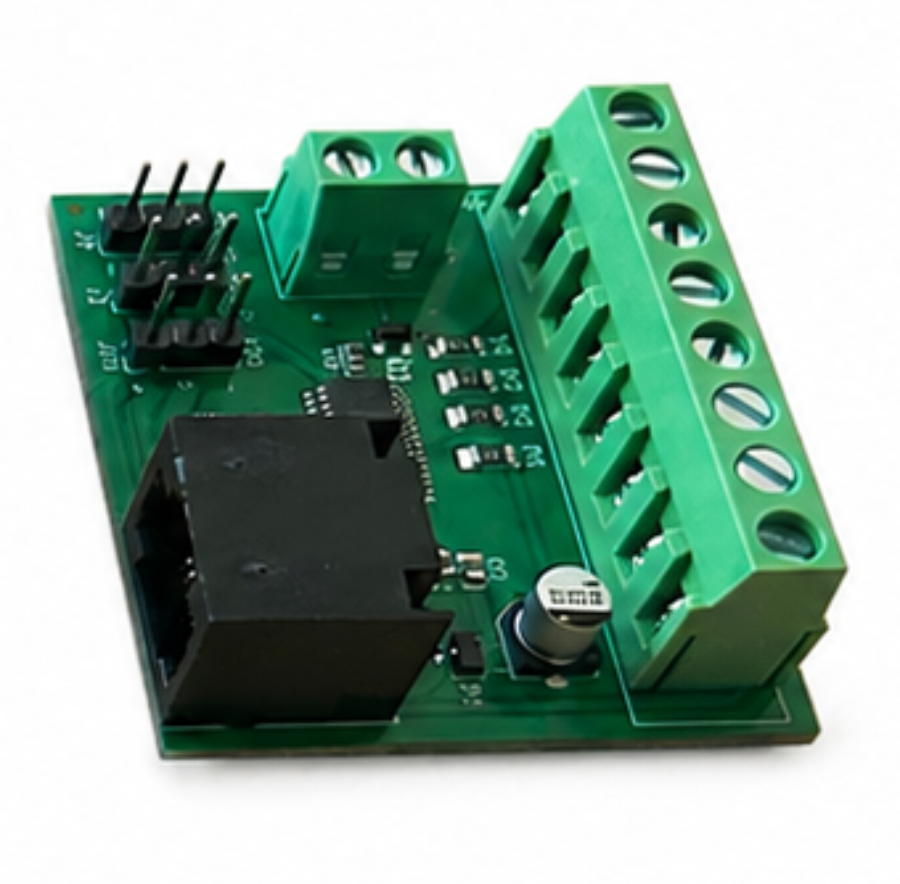

## Detailed System Description

The Training Village (TV) system is built upon a lightweight aluminum framework and an acrylic base, which securely supports the animal home cages and a connecting corridor that leads into an operant box.

<table style="width:100%; border-collapse:collapse; margin-bottom:1em; font-size:inherit; font-family:inherit;">
<tr>
<td style="width:70%; vertical-align:top; padding-right:2em; border:none;">

The entire ecosystem is centralized around a **Raspberry Pi 5** running Python code. The Raspberry directly manages the following primary peripherals:

<ul>
  <li><strong>Dual Camera System:</strong> Two <a href="https://www.raspberrypi.com/products/camera-module-3/">Raspberry Pi Cameras</a> are deployed—one integrated directly into the corridor and another to be positioned inside the operant box.</li>
  <li><strong>Audio System (Optional):</strong> A dedicated <a href="https://www.raspberrypi.com/products/iqaudio-dac-plus/">Raspberry Pi Sound HAT</a> can be attached to deliver acoustic stimuli during behavioral tasks.</li>
  <li><strong>Interactive Interface (Optional):</strong> A touchscreen can be integrated to present visual stimuli and record the animals' touch responses.</li>
</ul>

</td>
<td style="width:30%; vertical-align:top; border:none;">

</td>
</tr>
</table>

The system features universal operant box compatibility. While it natively communicates with [**Bpod**](https://sanworks.io/) and [**Arduino**](https://www.arduino.cc/), it can be easily adapted to alternative behavioral controllers (such as [**Harp**](https://harp-tech.org/) or [**PyControl**](https://pycontrol.readthedocs.io/)) simply by modifying the communication protocols.

Thanks to high-speed communication between the Raspberry Pi and the behavioral controller (if used), experimental workloads are efficiently split between the two devices:

*   **The Raspberry Pi** handles heavy computational and multimedia tasks, such as real-time position monitoring via video-tracking, triggering localized sound or video playback based on events or animal coordinates, managing LED matrices, or driving servo motors.
*   **The Behavioral Controller (Bpod/Arduino)** can be used for time-critical or high-precision events, such as photogate detection, delivering water rewards at a behavioral port, or sending rapid TTL signals to external hardware like optogenetic lasers.

A custom main HAT is mounted onto the Raspberry Pi 5 to handle power and data distribution. It receives a 5V power supply and utilizes two Ethernet ports to safely bridge both power and data to two specialized satellite boards.

---

### Satellite Board 1: The Corridor Board

<table style="width:100%; border-collapse:collapse; margin-bottom:1em; font-size:inherit; font-family:inherit;">
<tr>
<td style="width:70%; vertical-align:top; padding-right:2em; border:none;">
Controls the following peripherals installed in the corridor:
<ul>
  <li><strong>RFID Reader:</strong> Used in tandem with the video camera to reliably identify individual animals.</li>
  <li><strong>Weighing Scale:</strong> Features an integrated load cell within the corridor to automatically weigh animals as they return to their home cages.</li>
  <li><strong>Visible &amp; Infrared (IR) Lighting:</strong> Manages a 12:12h day/night cycle to safeguard animal welfare while providing IR night-vision for the cameras during dark phases.</li>
  <li><strong>2 Servo Motors:</strong> Controls the corridor doors providing automated access to the operant box.</li>
  <li><strong>Integrated Ambient Temperature Sensor:</strong> Continuously monitors the corridor environment.</li>
</ul>
</td>
<td style="width:30%; vertical-align:top; border:none;">

</td>
</tr>
</table>

---

### Satellite Board 2: The Box Board

<table style="width:100%; border-collapse:collapse; margin-bottom:1em; font-size:inherit; font-family:inherit;">
<tr>
<td style="width:70%; vertical-align:top; padding-right:2em; border:none;">
Features optional connectors for the user to utilize as needed:
<ul>
  <li><strong>2 Servo Motor Connectors:</strong> For managing mechanisms inside the box.</li>
  <li><strong>Internal Visible &amp; Infrared (IR) Lighting Connectors:</strong> To provide illumination inside the box.</li>
  <li><strong>Addressable/Programmable LED Connector:</strong> To connect programmable LED strips or matrices, specifically dedicated to delivering precise visual stimuli during tasks.</li>
</ul>
</td>
<td style="width:30%; vertical-align:top; border:none;">

</td>
</tr>
</table>

---

### Software & Experimental Workflow

The Training Village framework operates entirely on Python and is managed exclusively via remote access from an external laptop or PC connected to the Raspberry Pi.

To run and manage experiments, the user creates a centralized project folder containing two essential Python components:

*   **Task Scripts:** User-defined scripts that govern the behavioral tasks, handle communication with the underlying controller (Bpod, Arduino, etc.), and log data in the standardized format required by the TV ecosystem.
*   **Training Protocol Script:** A master automation script that dictates the animal's learning progression. It evaluates performance metrics after sessions, updates task variables, and automatically transitions the subject to advanced training stages once pre-set benchmarks are met.

Below is a summary of the standard operational cycle:

