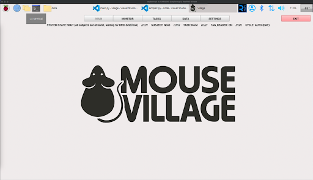

# Using the GUI

## Software Launch and Configuration

Now that you have your Training Village installed, let's run it for first time and configure some settings.

## First Boot Configuration

For the first time, connect the Raspberry Pi to a keyboard, mouse, and screen. For performance reasons, the screen resolution is set to 1280x720.
Once the operating system boots, you should simply configure the internet connection.
After that, open a terminal and run:

```{code-block}
:caption: Run on terminal
run_village
```

The following screen should appear:


There is a menu in the top, lets start by configuring the settings.
