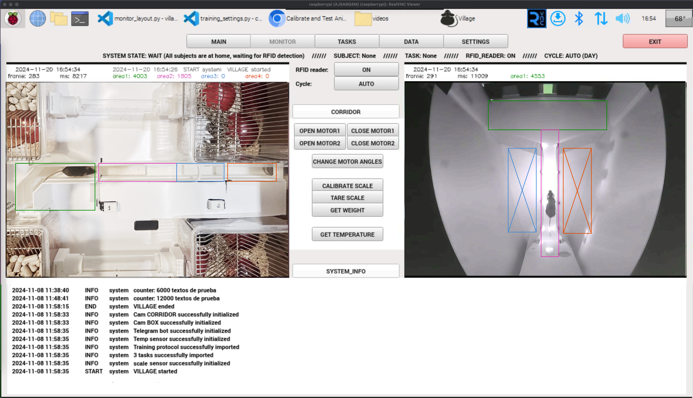

## Using the GUI

Once the system is set up for remote access, disconnect the keyboard, mouse, and monitor, and place the Raspberry Pi in its designated position in the corridor. Connect the two servo motors, the RFID reader, and the temperature sensor. Connect the two cameras as well. Also, connect the Bpod to the USB port closest to the Raspberry Pi’s Ethernet port.


To run the Training Village, open a terminal window and type:
```
run_village
```

This will activate a Python environment (.env) and execute the file `/home/raspberry/village/village/main.py`.

When the GUI starts, the system checks the connection with various necessary components (cameras, temperature sensor, weight sensor, etc.). If any connection cannot be established, a warning message will appear, and Training Village will run in testing mode. If you encounter any connection issues, refer to the [troubleshooting section][TROUBLE].

Once the GUI starts, you will see a menu at the top with the following options: MAIN, MONITOR, TASKS, DATA, and SETTINGS.


### MAIN


This is the default screen. In this screen the Raspberry Pi doesn’t need to do any rendering work to display videos (although videos continue to be recorded and saved). If the user doesn’t take any action for 5 minutes, the system automatically returns to this screen.


### MONITOR



This screen is used to monitor the system’s status, including both the corridor and the behavioral box.
We can see images captured by the two cameras: one above the corridor and one recording the behavioral box. There are several buttons at the top center:

- STOP TASK: Manually stops a task.
- GO TO WAIT STATE: Automatically sets the system to WAIT mode. [Here][STATES] we described the different states the system can be in.
- Tag Reader: (ON/OFF). Enables or disables the RFID reader.
- Cycle: AUTO/DAY/NIGHT. Since lighting changes with the day-night cycle, some camera parameters need to be adjusted accordingly. This button allows you to manually switch to day or night mode for testing and adjustments.
- Info: (DETECTION SETTINGS/SYSTEM INFO). This button switches the information displayed at the bottom of the screen.
- SYSTEM INFO shows recent system events.
- DETECTION SETTINGS: Allows control over parameters for detecting animals in both the corridor and the behavioral box. In the [detection section][DETECTION], we provide a detailed explanation of how these settings work.
- Actions: (CORRIDOR/PORTS/FUNCTIONS). This button switches between different groups of actions you can perform in real time.
    - CORRIDOR: list of buttons to open and close the doors, get a weight from the scale and get the temperature and humidity in the room.
    - PORTS: list of buttons that allow you to turn on the LEDs in the behavior ports.
    - FUNCTIONS: list of buttons to launch user-created Python functions (such as functions to display stimuli on a screen, play sounds, etc.).


### TASKS

### DATA

### SETTINGS


[TROUBLE]: /troubleshooting_index.rst
[STATES]: /user_guide/state_machine.md
[DETECTION]: /user_guide/detection.md

<br>
