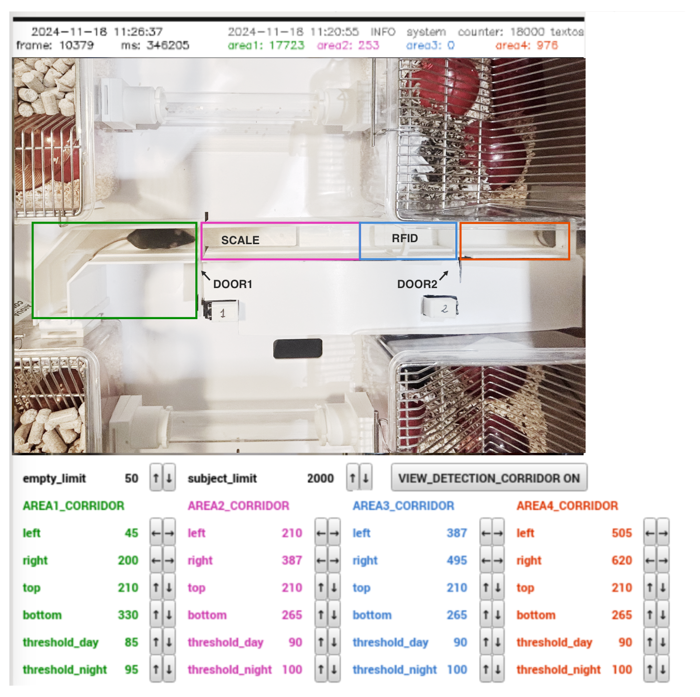
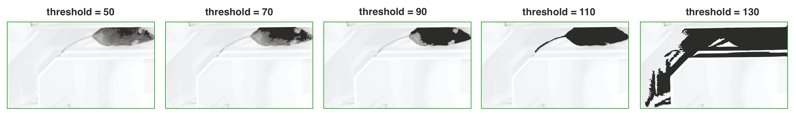
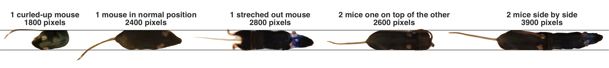

## Animal Detection

An automated animal detection algorithm operates continuously on both the corridor camera and the behavioral box camera. The algorithm processes the image by converting it to black and white pixels based on a set luminance threshold (pixels above the threshold are marked white, those below are black). By counting the black pixels, the system determines whether a specific area is empty, contains one mouse, or holds multiple animals.

The corridor is typically constructed from white filament to facilitate detecting darker-colored animals, though it can also be built in black to detect light-colored animals. Detection of dark or light pixels can simply by set by adjusting the corresponding [settings][SETTINGS].

### Detection in the Corridor

To set up detection in the corridor, begin by configuring the three designated areas (green, magenta, and blue rectangles):

- Area 1: Should cover the section of the corridor before the first door.
- Area 2: Should span from the first door up to the start of Area 3.
- Area 3: Begins where Area 2 ends and continues to the second door. Area 3 must be large enough to fully contain one mouse but not exceed that size significantly.

When an animal is detected by the RFID antenna, the system checks the status of all three areas. For an animal to be permitted to enter, both Area 1 and Area 2 must be empty, while pixel detection should only occur in Area 3. These conditions must be met for 500 ms, and no other animal should have been detected within the last 15 seconds. If multiple animals attempt to enter the corridor simultaneously, and one is detected by RFID but is not allowed to proceed due to other detections in the corridor, the system enforces a 15-second wait before allowing another animal to enter. These time parameters are adjustable in the [settings section][SETTINGS].

Each area has separate threshold values for day and night. At night, illumination comes solely from an infrared lamp, while during the day, the room lights provide additional lighting, creating slight variations in brightness. Different thresholds can be set for each area to account for any reflections or shadows affecting illumination. Accurate threshold configuration is essential for reliable detection.
To set these thresholds, allow an animal to enter the corridor and activate the `VIEW_DETECTION_CORRIDOR` setting to visualize detected pixels. Ideally, only the animal’s pixels should be detected, with minimal detection beyond the animal itself.

This helps illustrate how threshold adjustments impact detection accuracy.

Once these primary thresholds are set, configure two additional thresholds:
- max_area_no_mouse: This defines the maximum number of pixels that can be detected while confirming that no animal is in the area. Minor noise or image artifacts may occur, so allowing for up to 40 or 50 pixels while still considering the area empty is usually reasonable.
- max_area_one_mouse: This defines the maximum pixel count that still indicates only one animal is present. This threshold depends largely on the animals’ size. To determine it, observe a single animal’s pixel count as it moves within the corridor, noting that pixel count may vary based on its posture (crouched or stretched out) and individual size. Similarly, allow two animals in the corridor and record their combined pixel count.

In this example, one animal might range between 1800 and 2800 pixels, while two animals might range from 2600 to 3600 pixels. Setting this threshold to around 2500 pixels provides a safe margin, though there may be cases where a single animal is not allowed to enter if it stretches fully. Two animals can be detected as one if perfectly aligned, one on top of the other. To minimize such errors, the algorithm requires that the camera detection conditions be stable for at least 500 ms after an RFID detection, as it is unlikely for two animals to stay perfectly aligned for that duration.

[SETTINGS]: /user_guide/GUI.md#settings
